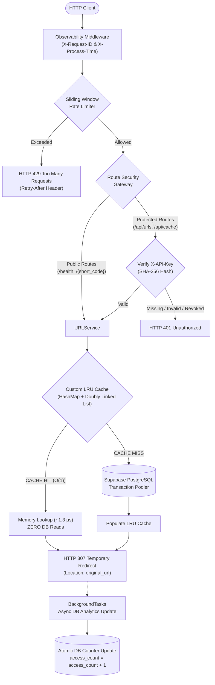
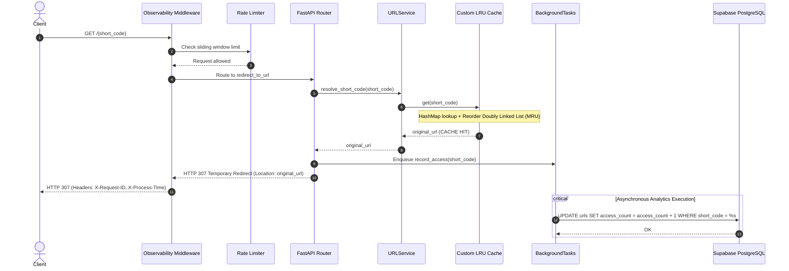
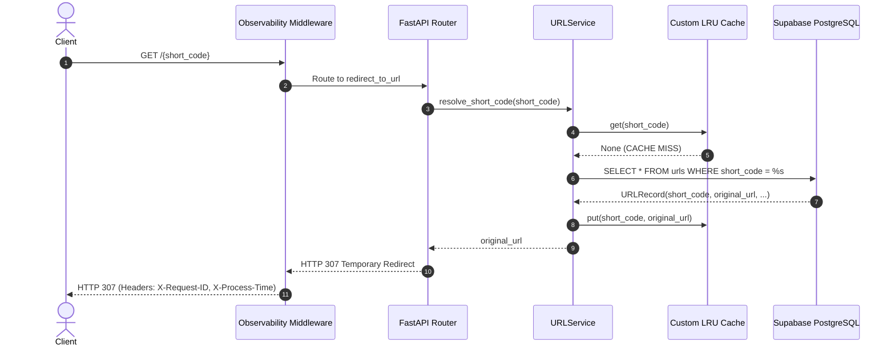

# CacheShort — LRU-Cache-Backed URL Shortener

An educational, high-performance URL-shortening backend built with FastAPI, PostgreSQL (hosted on Supabase), and a custom in-memory Least Recently Used (LRU) Cache implemented from scratch using a HashMap + Doubly Linked List with full observability metrics, sliding-window rate limiting, database-backed hashed API-key authentication, and request timing telemetry.

---

## 1. Project Overview

**CacheShort** is designed to demonstrate clean backend architecture, data structure fundamentals, and caching mechanics. In high-throughput URL shortening services, lookups follow the Pareto distribution (80-90% of redirects hit a small subset of hot/viral URLs). Querying the database for every redirect creates unnecessary disk I/O and connection overhead. CacheShort solves this by placing an $O(1)$ custom LRU cache in front of the database.

### Key Capabilities
- **Public High-Speed Redirects:** `GET /{short_code}` and `GET /health` remain open, unauthenticated, and ultra-fast.
- **Cache-First URL Resolution:** Cache hits resolve directly from memory in ~1.3 microseconds with **zero database read queries**.
- **Asynchronous Analytics:** Access counts and timestamps persist to PostgreSQL asynchronously via FastAPI `BackgroundTasks` without stalling redirect responses.
- **Protected Management Endpoints:** `POST /api/urls`, `GET /api/urls/{short_code}`, `GET /api/urls/{short_code}/stats`, and `GET /api/cache/stats` enforce database-backed SHA-256 API key authentication via `X-API-Key`.
- **Production Observability:** Machine-readable structured JSON access logs, `X-Request-ID` correlation, `X-Process-Time` duration headers, and dynamic process uptime telemetry.

---

## 2. Architecture & Request Lifecycles

### Complete System Architecture



---

### Cache-Hit Resolution Sequence (Zero Database Reads)



---

### Cache-Miss Resolution Sequence



---

## 3. Observability & Telemetry

### 1. Response Headers
- **`X-Request-ID`:** Unique UUID string (or sanitized client trace ID) correlated across logs and error responses.
- **`X-Process-Time`:** Exact server execution duration in seconds measured using monotonic high-resolution clock (`time.perf_counter()`).

### 2. Structured JSON Logging
Every request emits a machine-readable JSON log record to `stdout`/`stderr`:
```json
{
  "timestamp": "2026-09-30T16:00:00.123456+00:00",
  "request_id": "8f3b6188-4c91-4e76-8869-7c85a498b824",
  "method": "GET",
  "path": "/k9ZaB1x",
  "status_code": 307,
  "duration_ms": 1.42,
  "client_ip": "203.0.113.195"
}
```
> **Security Guarantee:** Request bodies, query parameters, passwords, `DATABASE_URL`, and authentication headers (`X-API-Key`, `Authorization`) are strictly excluded from logs.

### 3. Dynamic Uptime Telemetry
The `/health` probe dynamically reports process uptime in seconds without hitting the database:
```json
{
  "status": "ok",
  "environment": "production",
  "cache_size": 42,
  "cache_capacity": 1000,
  "database": "healthy",
  "uptime_seconds": 3842.15
}
```

---

## 4. API Authentication Model

### Header Format
All protected management requests require:
```http
X-API-Key: cs_live_<cryptographically-random-token>
```
*(Note: `Authorization: Bearer` is intentionally not accepted in this phase).*

### Security Principles
1. **Never Stored in Plaintext:** Only a 64-character SHA-256 hexadecimal hash is stored in the `api_keys` table.
2. **Displayed Only Once:** Plaintext keys are shown only when generated via the bootstrap CLI and cannot be recovered later.
3. **No Credential Leaks:** Authentication failures return a uniform `401 Unauthorized` with `{"detail": "Invalid or missing API key"}` to prevent attackers from enumerating valid or revoked keys.
4. **Timing Attack Protection:** Hash comparisons use Python's `secrets.compare_digest`.
5. **Key Revocation:** Keys can be deactivated instantly by setting `is_active = FALSE` and `revoked_at = CURRENT_TIMESTAMP`.

---

## 5. Technology Stack

- **Language:** Python 3.12+
- **API Framework:** [FastAPI](https://fastapi.tiangolo.com/)
- **ASGI Server:** [Uvicorn](https://www.uvicorn.org/)
- **Data Validation & Settings:** [Pydantic v2](https://docs.pydantic.dev/) / `pydantic-settings`
- **Database:** PostgreSQL (hosted on [Supabase](https://supabase.com/))
- **Database Driver & Pool:** `psycopg` (v3) with `psycopg_pool.ConnectionPool` (`prepare_threshold=None`)
- **Deployment Platform:** [Render](https://render.com/)
- **Testing & Benchmarking:** [pytest](https://docs.pytest.org/), `httpx`

---

## 6. Project Structure

```
d:/python_project/
├── app/
│   ├── __init__.py
│   ├── main.py                     # FastAPI app, lifespan, middleware & router registration
│   ├── api/
│   │   ├── __init__.py
│   │   └── routes/
│   │       ├── __init__.py
│   │       ├── cache.py            # Cache metrics endpoint (Protected)
│   │       ├── health.py           # Health check & uptime telemetry (Public)
│   │       └── urls.py             # URL creation, redirect & analytics endpoints
│   ├── cache/
│   │   ├── __init__.py
│   │   ├── node.py                 # Doubly Linked List Node
│   │   └── lru_cache.py            # Custom HashMap + Doubly Linked List LRU Cache
│   ├── core/
│   │   ├── __init__.py
│   │   ├── config.py               # Settings & environment configuration
│   │   ├── middleware.py           # Observability, Request ID & timing middleware
│   │   ├── rate_limiter.py         # Thread-safe sliding window rate limiter
│   │   └── security.py             # Key generation, SHA-256 hashing, and verification dependency
│   ├── database/
│   │   ├── __init__.py
│   │   ├── connection.py           # Database connection pool manager
│   │   ├── repository.py           # URL data access repository (Postgres & InMemory)
│   │   └── api_key_repository.py   # API key data access repository (Postgres & InMemory)
│   ├── schemas/
│   │   ├── __init__.py
│   │   ├── api_key.py              # Safe API key metadata schemas
│   │   ├── cache.py                # Cache stats response schema
│   │   └── url.py                  # Pydantic request/response schemas
│   └── services/
│       ├── __init__.py
│       └── url_service.py          # Business logic, short-code generator, cache manager
├── benchmarks/
│   ├── benchmark_resolution.py     # In-process microsecond resolution benchmark
│   ├── benchmark_http.py           # Controlled HTTP load testing & percentile harness
│   ├── PERFORMANCE_REPORT.md       # Measured performance report across all tiers
│   └── README.md                   # In-process benchmark documentation
├── scripts/
│   └── create_api_key.py           # Safe CLI tool to generate and store hashed API keys
├── supabase/
│   └── migrations/
│       ├── 20260330000000_create_urls_table.sql
│       └── 20260330000001_create_api_keys_table.sql
├── tests/
│   ├── __init__.py
│   ├── test_api.py                 # FastAPI endpoint integration tests
│   ├── test_cache_metrics.py       # Cache metrics & thread-safety unit tests
│   ├── test_database.py            # Database repository & fallback enforcement tests
│   ├── test_lru_cache.py           # LRU Cache unit & eviction order tests
│   ├── test_middleware.py          # Observability, timing, logging & uptime tests
│   ├── test_rate_limiter.py        # Sliding window rate limiter unit tests
│   ├── test_security.py            # API key generation, hashing & authentication tests
│   ├── test_url_service.py         # URL service, cache-hit & collision logic tests
│   ├── test_url_stats.py           # URL Analytics endpoint tests
│   └── test_validation.py          # Input & URL format validation tests
├── .env.example                    # Sample environment variables template
├── .gitignore                      # Git ignore rules protecting secrets and caches
├── pytest.ini                      # Pytest configuration
├── README.md                       # Comprehensive documentation
├── render.yaml                     # Render Infrastructure-as-Code Blueprint
├── requirements.txt                # Pinned dependency definitions
└── runtime.txt                     # Target Python runtime version
```

---

## 7. API Endpoints Reference

| Method | Endpoint | Authentication | Rate Limited | Description |
| :--- | :--- | :---: | :---: | :--- |
| `GET` | `/health` | **Public** | No | Service health, cache size, DB status, uptime |
| `GET` | `/{short_code}` | **Public** | Yes | $O(1)$ LRU Cache redirect to original URL |
| `GET` | `/docs` | **Public** | No | Interactive OpenAPI Swagger UI |
| `GET` | `/openapi.json` | **Public** | No | OpenAPI 3.0 schema |
| `POST` | `/api/urls` | **Protected** (`X-API-Key`) | Yes | Create and shorten a new URL |
| `GET` | `/api/urls/{short_code}` | **Protected** (`X-API-Key`) | Yes | Retrieve URL metadata |
| `GET` | `/api/urls/{short_code}/stats` | **Protected** (`X-API-Key`) | Yes | Access analytics & timestamps |
| `GET` | `/api/cache/stats` | **Protected** (`X-API-Key`) | Yes | Observability stats of LRU cache |

---

## 8. Usage & Curl Examples

### 1. Health Probe with Uptime (Public)
```bash
curl -i https://cacheshort-api.onrender.com/health
```

### 2. Create Short URL (Protected)
```bash
curl -i -X POST https://cacheshort-api.onrender.com/api/urls \
  -H "X-API-Key: cs_live_your_actual_key_here" \
  -H "Content-Type: application/json" \
  -d '{"url": "https://fastapi.tiangolo.com/"}'
```

### 3. Public Redirect (No Key Required)
```bash
curl -i https://cacheshort-api.onrender.com/k9ZaB1x
```

### 4. Fetch Analytics (Protected)
```bash
curl -i https://cacheshort-api.onrender.com/api/urls/k9ZaB1x/stats \
  -H "X-API-Key: cs_live_your_actual_key_here"
```

---

## 9. Running Tests & Benchmarks

### 1. Run Automated Test Suite
```bash
pytest -v
```

### 2. Run In-Process Micro-Benchmark
```bash
python benchmarks/benchmark_resolution.py
```

### 3. Run Controlled HTTP Load Benchmark
```bash
# Benchmark local server
python benchmarks/benchmark_http.py --base-url http://127.0.0.1:8000 --endpoint /health --requests 20 --concurrency 1

# Controlled production benchmark
python benchmarks/benchmark_http.py --base-url https://cacheshort-api.onrender.com --endpoint /health --requests 10 --concurrency 1
```

For complete empirical benchmarks and methodology, refer to [`benchmarks/PERFORMANCE_REPORT.md`](file:///d:/python_project/benchmarks/PERFORMANCE_REPORT.md).
